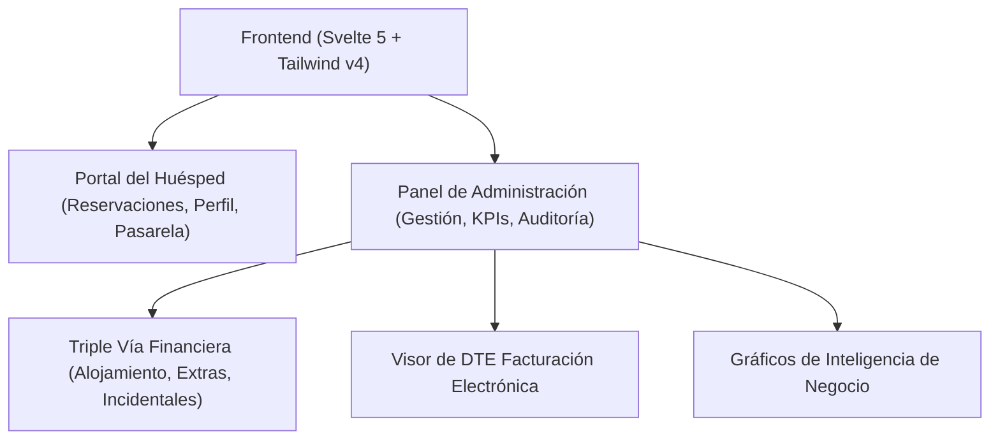

# 🏨 AFE Resort & Spa — Portal Frontend

> **Plataforma Web de Gestión Hotelera y Experiencia de Huéspedes**
>
> Diseñado bajo una estética visual de alta gama, arquitectura financiera de triple vía y cumplimiento tributario estricto de facturación electrónica (**DTE**) en El Salvador (`es-SV`).

---

## 🌟 Vista General del Proyecto

Este frontend representa la interfaz del cliente y el panel administrativo del resort de lujo **AFE Resort & Spa**. La interfaz ha sido desarrollada con un enfoque de excelencia visual, micro-animaciones fluidas, diseño totalmente adaptativo (Mobile-First) y carga interactiva de datos en tiempo real.



---

## 🛠️ Arquitectura Tecnológica (Tech Stack)

La aplicación utiliza tecnologías modernas para garantizar la máxima velocidad de carga (Core Web Vitals), modularidad limpia y un desarrollo robusto orientado a tipado estricto:

*   **Núcleo del Framework**: [Svelte 5](https://svelte.dev/) utilizando el nuevo sistema de reactividad reactiva y eficiente: **Runes** (`$state`, `$derived`, `$effect`, `$props`).
*   **Enrutador y Server Rendering**: [SvelteKit 2](https://kit.svelte.dev/) con enrutamiento basado en archivos y pre-carga inteligente de datos.
*   **Motor de Estilizado**: [Tailwind CSS v4](https://tailwindcss.com/) para estilos atómicos veloces y fluidos.
*   **Lenguaje**: [TypeScript](https://www.typescriptlang.org/) para un tipado estricto que previene errores en compilación.
*   **Iconografía**: [Lucide Svelte](https://lucide.dev/guide/svelte) para iconos vectoriales limpios y homogéneos de marca.
*   **Generación de Documentos**: [jsPDF](https://github.com/parallax/jsPDF) y [html2pdf.js](https://rawgit.com/eKoopmans/html2pdf/master/README.md) para la generación de reportes financieros en PDF de alta fidelidad.

---

## 💎 Características Principales del Portal

### 1. Sistema de Triple Vía Financiera y Condonaciones
Manejo independiente de los tres flujos de ingresos del hotel para resguardar la consistencia contable:
*   **Alojamiento (`total_cost`)**: Costo base del hospedaje con impuestos aplicables.
*   **Servicios Extras (`extras_total`)**: Consumo de amenidades del catálogo del hotel (masajes, desayunos, tours).
*   **Cargos Incidentales (`incidentals_total`)**: Registro ad-hoc manual de cargos (daños, minibar) con capacidad de adjuntar fotos de evidencia de Cloudinary y condonaciones justificadas con snippets de Svelte 5.
*   **Visualización en Neto y Bruto**: Los KPIs y gráficos del panel financiero se calculan de manera simétrica permitiendo alternar al instante entre valor neto (base sin impuestos) e importe bruto (cobrado con IVA).

### 2. Pasarela de Pagos Multicanal
*   **Wompi Integrado**: Redireccionamientos seguros a la pasarela oficial Wompi de El Salvador con generación en tiempo real de links de pago protegidos.
*   **Transferencia Bancaria**: Módulo de carga interactiva de comprobantes de depósito para verificación de administradores.

### 3. Facturación Electrónica (DTE El Salvador)
*   Integración directa con el Ministerio de Hacienda para facturación de Consumidor Final y Crédito Fiscal.
*   **Imputación Pro-Rata**: Distribución secuencial de abonos parciales entre conceptos del folio para evitar descuadres aritméticos.
*   **Desglose Dinámico de Ítems**: El visor web de DTE (`/admin/pagos/[id]/dte`) renderiza en tiempo real los conceptos cubiertos por la transacción, aplicando IVA (13%) y Turismo (5%) de manera dinámica según las configuraciones del servidor en lugar de usar valores fijos en el código.

### 4. Inteligencia de Negocio y Reportes Financieros
*   **Tendencia de Ventas Separada**: Gráfico de líneas vectorial SVG interactivo que separa el Alojamiento, Servicios Extras y Cargos Incidentales en tres curvas dinámicas (`Línea Dorada`, `Cobriza` y `Esmeralda`) con tooltip flotante de hover.
*   **ADR & RevPAR Dinámico**: Cálculo al instante de métricas clave hoteleras.
*   **Libro Auxiliar Diario**: Tabla interactiva de transacciones diarias ordenadas cronológicamente de forma descendente, destacando la fecha de hoy con un borde de oro y la etiqueta premium `[Hoy]`.
*   **Exportación Premium**: Botones vectoriales de exportación a archivos CSV y PDF con alineación y justificación milimétrica.

---

## 🇸🇻 Estándares de Localización Oficial (El Salvador)

El sistema ha sido estructurado siguiendo estrictamente las regulaciones y formatos del mercado salvadoreño:
*   **Código de Locale**: `es-SV`
*   **Moneda Oficial**: USD ($) con coma para miles y punto para decimales (ej: `$1,250.75`).
*   **Formato de Fechas**: `DD/MM/YYYY` (ej: `29/05/2026`).
*   **Formato de Horas**: 12 horas con AM/PM (ej: `3:45 PM`).
*   **Zona Horaria**: `America/El_Salvador` (GMT-6, sin cambio de horario).
*   **Formato Telefónico**: `+503 XXXX-XXXX` validado en tiempo real con la librería `libphonenumber-js`.
*   **Tasas de Impuesto**: IVA 13% e Impuesto de Turismo 5% cargados de forma dinámica.

---

## 🚀 Configuración e Instalación Local

### Requisitos Previos
*   [Node.js](https://nodejs.org/) (versión 18 o superior recomendada).
*   Un gestor de paquetes como `npm` (incluido con Node).

### 1. Clonar el repositorio e ingresar a la carpeta
```sh
cd ProyectoAFE/proyecto-frontend
```

### 2. Instalar Dependencias
```sh
npm install
```

### 3. Configurar el Archivo de Entorno (`.env`)
Crea un archivo llamado `.env` en la raíz de la carpeta `proyecto-frontend` (si no existe ya) y define la URL del servidor Backend FastAPI:
```env
# URL base de la API de FastAPI
VITE_API_URL=http://localhost:8000
```

### 4. Iniciar el Servidor de Desarrollo
```sh
npm run dev
```
El portal frontend estará disponible en tu navegador en: [http://localhost:5173/](http://localhost:5173/)

---

## 📦 Construcción para Producción

Para compilar la aplicación optimizada para producción:

```sh
# Genera el bundle de producción en la carpeta .svelte-kit
npm run build
```

Puedes previsualizar el bundle de producción compilado localmente ejecutando:
```sh
npm run preview
```

---

## 📁 Estructura del Proyecto

```bash
proyecto-frontend/
├── src/
│   ├── lib/                  # Código modular reutilizable
│   │   ├── components/       # Componentes de UI (Reportes, Tooltips, KPIs)
│   │   ├── services/         # Consumo de APIs (pagos, reservaciones, incidentales)
│   │   └── utils/            # Utilidades y exportaciones PDF/CSV
│   ├── routes/               # Enrutamiento basado en directorios (SvelteKit)
│   │   ├── (protected)/admin # Rutas exclusivas del Staff y Gerencia
│   │   │   ├── pagos/        # Listado de cobros, KPIs premium y visor DTE
│   │   │   ├── reservaciones/# Control de reservaciones y cargos incidentales
│   │   │   └── reportes/     # Panel de Inteligencia Financiera y Gráficos SVG
│   │   ├── (user)/           # Portal del Huésped (pagos, perfil)
│   │   └── +layout.svelte    # Layout base de navegación del portal
│   └── app.html              # Archivo HTML raíz de la aplicación
├── static/                   # Recursos estáticos (Logotipos de Hacienda, Imágenes de Marca)
├── svelte.config.js          # Configuración del compilador Svelte
├── tailwind.config.js        # Configuración del tema visual de Tailwind
├── vite.config.ts            # Configuración de compilación de Vite
└── tsconfig.json             # Ajustes de TypeScript
```

---

